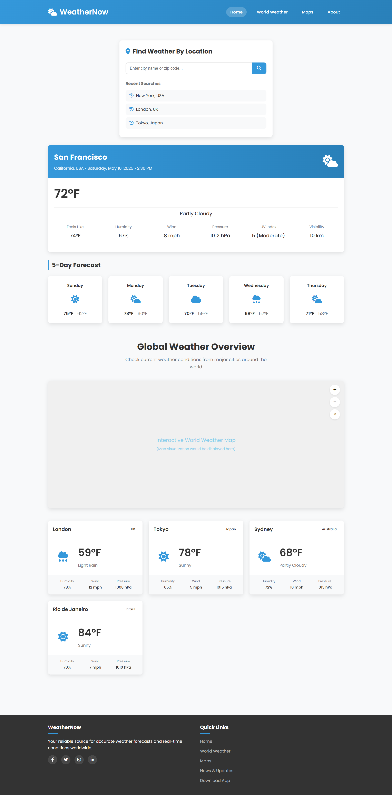

# Weather-App

This is a beginner-friendly weather app built using **HTML**, **CSS**, **JavaScript**, and a public API. The app allows users to search for weather information for any location, displaying current weather details such as temperature, humidity, wind speed, and weather conditions.

## Features

- Search weather by location (city name)
- Displays temperature, humidity, wind speed, and weather conditions
- Responsive design for mobile and desktop
- Clear and simple UI design with icons representing different weather conditions

## Tech Stack

- **HTML** – Structure of the web pages
- **CSS** – Styling the app and creating a responsive layout
- **JavaScript** – Handling the functionality and connecting to the weather API
- **OpenWeatherMap API** – Fetching live weather data

## Setup Instructions

To run this project locally, follow the steps below:

### 1. Clone the repository

```bash
git clone <repository-url>
cd <folder-name>
##Preview


